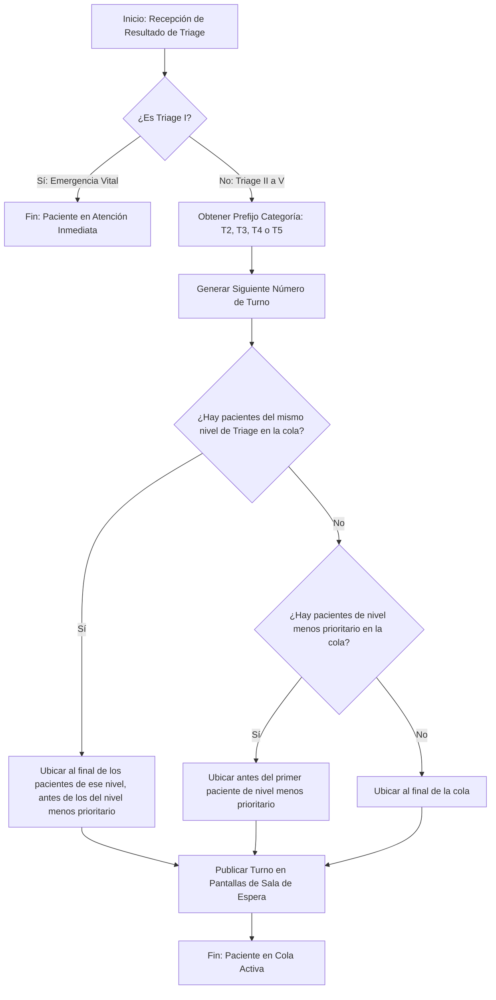

# REQ-04: Asignación Automatizada de Turno según Resultado de Triage

**Integrantes del Equipo:**
- Bryan Gustavo Llontop Angulo (@BLlontopSec)
- Diego Stevan Anacona Velez (@elDIEGO12)
- Diego Ibáñez (@Dielix22)
- Adrien ROHO (@hoverwars)
- Sebastian Eisneider Rey Pretel (@sereypretel)

**ID del Requerimiento:** REQ-04  
**Título del Requerimiento:** Asignación de Número de Turno para el Paciente Basado en Triage  
**Módulo:** Gestión de Triage y Colas de Atención  

---

## 1. Visión General (Overview)

* **Declaración del Requerimiento (Statement):**  
  Usando el resultado del triage, el sistema debe asignar automáticamente un número de turno priorizado para el paciente y posicionarlo en la cola de atención médica.

* **Tipo de Requerimiento:**  
  Funcional.

* **Fuente / Evidencia (Source / Evidence):**  
  Hoja de Descubrimiento (Clase 8) — Hallazgo #04: *"Falta de visibilidad, desorden en el llamado de pacientes en sala de espera y quejas por aparente desatención a casos prioritarios"*.

* **Necesidad (Need):**  
  Establecer un mecanismo de ordenamiento objetivo y automatizado en la sala de espera que reemplace el orden de llegada por un modelo basado en la gravedad clínica.

* **Valor / Justificación (Value / Rationale):**  
  Posicionar al paciente de forma transparente en la cola de espera respetando su urgencia clínica, notificando a la sala de espera para garantizar que los casos de mayor riesgo vital se atiendan dentro de los tiempos estipulados.

---

## 2. Contexto (Context)

* **Regla de Negocio (Business Rule):**  
  `BR-TRG-02`: El orden en la cola de espera prioriza siempre el nivel de Triage (`II > III > IV > V`). En caso de presentarse pacientes con el mismo nivel de Triage, el sistema desempatará por orden cronológico de ingreso al sistema.

  `BR-TRG-03`: Un paciente con un nivel de Triage I no pasa por el algoritmo de gestion de turno, se va directamente en estado de atencion.

* **Restricción (Constraint):**  
  `CON-TRG-02`: El número de turno generado por el sistema es inalterable por el personal médico ni el paciente, es decir no puede ser modificado manualmente por el personal médico, administrativo ni por el paciente.

* **Supuesto (Assumption):**  
  `AS-TRG-02`: Se asume que el profesional de enfermería/médico ya completó y guardó la valoración clínica del paciente en el módulo de Triage previo.

* **Dependencia (Dependency):**  
  `DEP-TRG-02`: Depende de 
  - `REQ-01`: Registro del paciente
  - `REQ-02`: Registrar los signos vitales del paciente en el sistema
  - `REQ-03`: Calculo del nivel de prioritad usando el triage

* **Riesgo (Risk):**  
  `RSK-TRG-02`: Acumulación de pacientes de menor prioridad (Triage IV y V) con tiempos de espera indefinidos durante jornadas de alta concurrencia de emergencias.

* **Preguntas Abiertas (Open Questions):**  
  * `Q1`: Como representar un numero de turno valido en nuestra sistema ? Ahora proponemos un numero de la forma `T3-045` donde `T3` seria el nivel de Triage y `045` significa que este paciente es el paciente numero 45 hoy; Los numeros se reinician cada dia, a medianoche.

---

## 3. Prioridad y Estimación (Priority & Estimation)

* **Modelo de Priorización Aplicado:**  
  MoSCoW. Utilizamos esta metodologia porque nos faltan elementos para calcular a las variables de la formula RICE.

* **Prioridad Asignada:**  
  **Must Have (Crítico)**.

* **Argumentación de Prioridad:**  
  Sin la asignación automatizada del turno, el resultado del Triage es inútil a nivel operativo. El sistema no tendría cómo indicar qué paciente sigue ni reflejar el orden en las pantallas, bloqueando el llamado médico.

* **Estimación Basada en Confianza:**  
  * **Nivel de Confianza:** Alto (90%).  
  * **Estimación:** Parece complicado pero nos faltan elementos para establecer una estimacion del nivel de complejidad.

---

## 4. Representaciones (Representations)

### 4.1. Historia de Usuario (User Story)

**Como** Enfermera / médico de Triage,  
**Quiero** asignar un número de turno priorizado utilizando el resultado del Triage,  
**Para** posicionar al paciente de forma transparente en la cola de espera respetando su urgencia clínica y notificar a la sala de espera.

---

### 4.2. Criterios de Aceptación (Acceptance Criteria - BDD)

* **Escenario 1: Asignación de turno estándar (Flujo Principal)**
  * **Dado** que se ha guardado exitosamente el resultado del Triage de un paciente,
  * **Cuando** el sistema procesa el resultado,
  * **Entonces** genera un número de turno con el prefijo correspondiente (ej. `T3-045`), posiciona al paciente en la cola según las reglas de negocio y envía la actualización a las pantallas de espera.

* **Escenario 2: Bypass por Emergencia Vital (Triage I)**
  * **Dado** que el resultado del Triage guardado es "Triage I" (Reanimación),
  * **Cuando** el sistema procesa el resultado,
  * **Entonces** el sistema excluye al paciente de la cola de la sala de espera pública, el paciente debe ser tratado inmediatamente por los medicos.

* **Escenario 3: Desempate por hora de llegada**
  * **Dado** que la cola ya tiene pacientes en espera nivel Triage III,
  * **Cuando** ingresa un nuevo paciente clasificado como Triage III,
  * **Entonces** el sistema le asigna un número de turno y lo ubica en la cola detrás del último paciente Triage III existente, respetando el orden de llegada entre ellos.

---

### 4.3. Caso de Uso y Diagrama de Flujo (Use Case & Flow Diagram)

* **Actor:** Enfermera / médico de Triage.
* **Meta:** Asignar un turno y posicionar al paciente en la sala de espera según su gravedad.
* **Precondición:** Paciente valorado y con nivel de Triage I, II, III, IV o V guardado en base de datos.
* **Postcondición:** Turno alfanumérico generado e insertado en la cola activa.

#### Diagrama de Flujo de Caso de Uso (Mermaid)

---

## 5. Trazabilidad e Impacto (Traceability & Impact)

* **Trazabilidad hacia Atrás (Backward Traceability):**  
  Este requerimiento se origina para resolver el caos organizativo documentado en la fase de descubrimiento. Como el flujo de pacientes presenta niveles de gravedad que varían constantemente, asignar el orden de atención de forma manual o por simple llegada genera un riesgo clínico inaceptable. Necesitamos este requerimiento para garantizar un orden estricto que proteja a los pacientes; no solo evita el desorden en la sala de espera, sino que asegura que quienes tienen heridas o condiciones de mayor riesgo vital sean atendidos primero, evitando que su salud se deteriore mientras esperan

* **Trazabilidad hacia Adelante (Forward Traceability):**  
  * **Arquitectura:** Impacta el diseño del módulo de publicacion de notificacion para mantener sincronizadas las pantallas de la sala.
  * **Pruebas:** Define los casos:
    * `TEST-REQ04-SortPriority`: Valida que un Triage de mayor gravedad adelante a uno de menor gravedad.
    * `TEST-REQ04-SameTriageOrder`: Valida el desempate cronológico cuando ingresan pacientes con el mismo nivel de Triage.
    * `TEST-REQ04-Triage1-Bypass`: Valida que el Triage I omita la sala de espera y alerte directamente a reanimación.
    * `TEST-REQ04-SendNotificacion`: Valida la correcta emisión del turno hacia las pantallas públicas.

  > Actualmente, la trazabilidad hacia adelante se queda general en cuanto a la parte de la implementacion y del diseño futuro porque no tenemos todas las informaciones sobre como implementar nuestro sistema. Sin embargo, podemos definir ahora estos 4 tests que debemos cumplir para que nuestro sistema funcione correctamente.

* **Análisis de Impacto:**  
  Un fallo en este componente desordenaría la atención médica, impactando directamente al módulo de atención médica (llamado de pacientes desde consultorio) y alterando los indicadores de tiempos de atención.

---

## 6. Validación — Puerta de Calidad (Quality Gate)

| Criterio de Calidad                                                                                                         | Estado     | Justificación / Observación                                                                                                                                                                                                                                                                             |
|-----------------------------------------------------------------------------------------------------------------------------|------------|---------------------------------------------------------------------------------------------------------------------------------------------------------------------------------------------------------------------------------------------------------------------------------------------------------|
| :---                                                                                                                        | :---:      | :---                                                                                                                                                                                                                                                                                                    |
| 1. **¿Válido?** ¿Refleja una necesidad real y evidenciada, no inventada?                                                    | [x] Cumple |                                                                                                                                                                                                                                                                                                         |
| 2. **¿Claro / Sin ambigüedad?** ¿Existe una sola interpretación razonable?                                                  | [x] Cumple |                                                                                                                                                                                                                                                                                                         |
| 3. **¿Atómico?** ¿Es una única expectativa comprobable de forma independiente, no varias agrupadas?                         | [x] Cumple |                                                                                                                                                                                                                                                                                                         |
| 4. **¿Necesario?** ¿Eliminarlo rompe realmente algo?                                                                        | [x] Cumple |                                                                                                                                                                                                                                                                                                         |
| 5. **¿Factible?** ¿Se puede construir de forma realista con lo que tiene el equipo?                                         | [ ] Cumple | Por 2 puntos:  - Aun no hemos definido el diseño de arquitectura y la implementacion - La parte donde mandamos notificaciones a la pantalla de espera podria ser dificil de implementar con nuestros conocimientos actuales de codigo (pero tendremos ayuda de AI)                                      |
| 6. **¿Verificable?** ¿Se puede demostrar concretamente si se cumple?                                                        | [x] Cumple |                                                                                                                                                                                                                                                                                                         |
| 7. **¿Consistente?** ¿Entra en conflicto con algún otro requerimiento del conjunto?                                         | [ ] Cumple | Podria entrar en conflicto con 1 requerimiento funcional:  El RF-06, donde podemos cambiar la prioridad de algunos pacientes en un mismo nivel de Triage. Este nuevo requerimiento entra en conflicto con la regla BR-TRG-02. Pero lo hicimos de esta manera para que este requerimiento quede atomico. |
| 8. **¿Suficientemente completo?** ¿Faltan funciones o restricciones importantes?                                            | [x] Cumple |                                                                                                                                                                                                                                                                                                         |
| 9. **¿Trazable?** ¿Cada parte del documento se puede rastrear hasta evidencia real, sin inventarse para llenar una sección? | [x] Cumple |                                                                                                                                                                                                                                                                                                         |